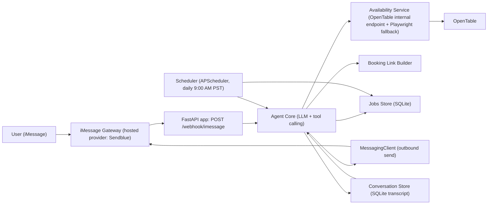
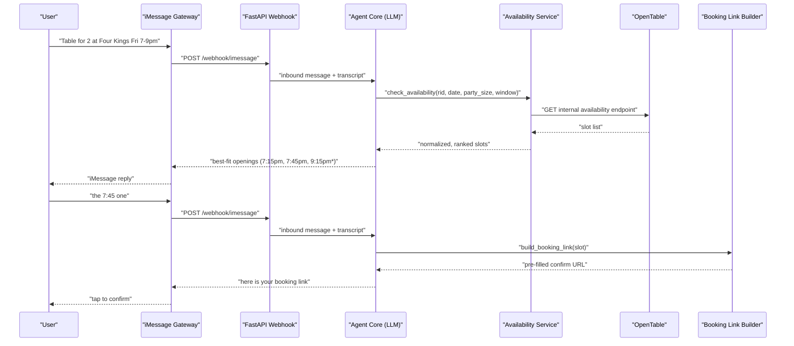

# Restaurant Reservation Agent — Design

Status: draft for review (prototype scope). No application code exists yet; this document is the artifact we iterate on before building.

---

## 1. Overview & Goals

A text-based (iMessage) agent that helps a single user find reservation openings at a small, bounded set of favorite restaurants on OpenTable.

The user texts the agent in plain English (e.g. "table for 2 at Four Kings Friday between 7 and 9"). The agent parses the criteria, checks OpenTable availability for the configured restaurants, replies with the best-fit openings, and — once the user confirms a choice — replies with a **pre-filled OpenTable booking link** that the user taps to complete the reservation themselves.

### Goals

- Conversational reservation search over iMessage, no app or web UI.
- Bounded restaurant set, initially **Four Kings** and **Seven Hills** (San Francisco).
- Understand party size, date, and time-window criteria from free-form text.
- Rank and return best-fit openings; support follow-up messages ("what about Saturday?").
- Return a pre-filled booking link for the user's chosen slot.
- Standing monitoring requests: a daily job that texts the user when a matching opening appears.

### Non-goals (prototype)

- **No end-to-end automated booking.** The agent stops at a pre-filled link; the user taps confirm. Auto-booking is a future phase.
- **Single user only.** One allowlisted phone number; no accounts, auth, or multi-tenancy.
- **OpenTable only.** No Resy, Tock, Yelp, or direct-restaurant systems.
- No payments, no deposit/ticketed-event handling, no waitlists.
- No production-grade SLA, HA, or horizontal scaling.

---

## 2. Milestones

### M1 — On-demand search and booking link

1. User texts the agent (inbound iMessage → webhook).
2. Agent Core parses criteria: restaurant(s), party size, date, time window.
3. Availability Service checks OpenTable availability for the two configured restaurants.
4. Agent replies with the best-fit openings (ranked, concise list).
5. User confirms a choice in a follow-up text.
6. Agent replies with a pre-filled OpenTable booking link for that slot.

**Done when:** a real round-trip over iMessage produces a link that opens OpenTable's confirm page with restaurant, date, time, and party size pre-populated.

### M2 — Standing monitoring requests

1. User texts a standing request ("let me know if Seven Hills opens up for 4 any Friday in March, 6–8pm").
2. Agent creates a monitor record in the Jobs Store.
3. A scheduled job runs **daily at 9:00 AM PST (`America/Los_Angeles`)**, iterating all active monitors and checking availability.
4. On a hit, the agent texts the user the matching openings and asks them to pick one.
5. User picks → agent replies with a pre-filled booking link (same path as M1 steps 5–6).
6. Monitors can be listed and cancelled by text; they expire after their target date passes.

**Done when:** a monitor created on day N produces a proactive text on day N+1 at 9:00 AM PST when a matching slot exists.

---

## 3. Architecture

### Component diagram



### M1 sequence diagram



---

## 4. Components

### (a) `MessagingClient` — iMessage abstraction

An interface abstracting the hosted iMessage provider so the prototype is not welded to one vendor.

```
class MessagingClient(Protocol):
    def send(self, to: str, text: str) -> MessageId: ...
    def parse_webhook(self, payload: dict) -> InboundMessage: ...   # normalize provider payload
```

- **`SendblueClient` (default)** — implements send via Sendblue's REST API; `parse_webhook` normalizes Sendblue's inbound payload into `InboundMessage(from_number, text, received_at, provider_message_id)`.
- **`LoopMessageClient` (stub)** — same interface, unimplemented methods raising `NotImplementedError`, present to prove the abstraction and to make swapping providers a config change.
- Inbound requests hit `POST /webhook/imessage`. The handler verifies the provider signature/secret, rejects any sender that is not `ALLOWLISTED_PHONE`, and hands the normalized message to the Agent Core.

### (b) Agent Core — LLM with out-of-the-box tool calling

The Agent Core is an LLM loop (Groq, OpenAI-compatible API) using standard tool/function calling. It owns **both** intent parsing and conversation state.

Tools exposed to the model:

| Tool | Arguments | Returns |
| --- | --- | --- |
| `check_availability` | `restaurant` (name or slug), `date`, `party_size`, `time_window_start`, `time_window_end` | ranked list of openings with slot identifiers |
| `create_monitor` | `restaurant`, `party_size`, `date_or_date_range`, `time_window_start`, `time_window_end` | `monitor_id`, human-readable confirmation |
| `build_booking_link` | slot identifier (`rid`, `datetime`, `party_size`, slot hash) | pre-filled OpenTable confirm URL |

**Explicitly out of scope: there is NO custom NLU parser and NO hand-written state machine.** State is handled by replaying the per-user transcript: every inbound and outbound message is appended to a SQLite conversation table, and each turn re-sends `system prompt + last N turns` to the model. Follow-ups like "the 7:45 one" or "what about Saturday?" resolve because the prior turns (including tool results) are in context, not because we track a dialogue state variable. Tool results are appended to the transcript as tool messages so slot identifiers stay resolvable on later turns.

The system prompt carries: today's date and timezone (`America/Los_Angeles`), the configured restaurant list, the time-window ranking semantics, the pre-filled-link (not auto-book) policy, and SMS-appropriate formatting rules (short, no markdown).

### (c) Availability Service — OpenTable lookups

- Primary path: OpenTable's **internal HTTP availability endpoint**, called with `httpx` (async), keyed by the restaurant's `rid`. Request carries date, party size, and a time anchor; response is normalized into:

```
Slot(rid, restaurant_name, datetime_local, party_size, slot_token, source)
```

- Sends realistic headers, a modest per-restaurant rate limit, retries with jitter on 429/5xx, and a short response cache (single-digit minutes) so repeated turns in one conversation do not re-hit OpenTable.
- **Playwright fallback**: if the internal endpoint changes shape, returns a challenge, or fails repeatedly, the service falls back to driving the public OpenTable restaurant page headlessly and scraping rendered slot buttons (which also yields the confirm URL directly). Slower, used only as a backstop, behind a feature flag.
- Ranking is applied here: slots strictly inside the requested window first (ordered by proximity to the window's midpoint or to a stated preferred time), then edge fallbacks (see §5).

### (d) Booking Link Builder

Turns a chosen `Slot` into a URL that opens OpenTable's confirm/booking page with restaurant, date/time, and party size pre-filled — so the user only taps to confirm.

- Built from `rid` + ISO datetime + party size (+ the slot token/hash when the availability response supplies one, since OpenTable's confirm page can require it).
- The exact parameter set must be **validated live** against real slots before M1 is called done; the builder is a small, isolated module precisely so this mapping can be corrected without touching the agent.
- Returns a plain HTTPS URL (no shortener) so iMessage renders a rich preview.

### (e) Scheduler + Jobs Store (M2)

- **Scheduler**: APScheduler running in-process with the FastAPI app, one cron trigger at `09:00` `America/Los_Angeles`. It loads all active monitors, calls the Availability Service for each, and on hits invokes the Agent Core to compose and send an outbound iMessage.
- **Jobs Store**: SQLite. Tables:
  - `monitors(id, phone, restaurant_rid, party_size, date_or_range, window_start, window_end, status, created_at, expires_at, last_checked_at, last_notified_at)`
  - `notifications(id, monitor_id, slot_signature, sent_at)` — de-duplicates so the same opening is not re-texted daily.
  - `conversations(id, phone, role, content, tool_call_json, created_at)` — the transcript the Agent Core replays.
- Monitors are cancellable by text and auto-expire past their target date.

---

## 5. Design decisions

| # | Decision | Rationale | Trade-off / risk |
| --- | --- | --- | --- |
| 1 | Use a **hosted iMessage provider** (Sendblue default) behind a `MessagingClient` interface | Self-hosting iMessage needs a always-on Mac and is fragile; a hosted provider gets us a real blue-bubble number in hours | Paid, subject to provider ToS and rate limits; interface keeps swap cost low (LoopMessage stub already in place) |
| 2 | Read availability from OpenTable's **internal HTTP endpoint** | Fast, structured JSON, no browser overhead | **Unofficial**: no stability guarantee, may violate OpenTable ToS, can break or start challenging requests without notice; Playwright fallback mitigates |
| 3 | **Single allowlisted phone number** | Prototype is for one user; removes auth, onboarding, and abuse surface | Anything from other numbers is dropped; multi-user is a roadmap item |
| 4 | Return a **pre-filled booking link**, do not auto-book | Keeps a human in the loop for a financially/socially binding action; avoids automated-booking ToS exposure and no-show risk while the slot mapping is unproven | Extra tap for the user; a slot can be taken between reply and confirm. Auto-booking is a deliberate future phase |
| 5 | **Hardcode Four Kings + Seven Hills in config**, but keep the path config-driven | Two restaurants is enough to prove the flow; `rid`s are discovered once and pinned | Adding a restaurant needs a config edit + `rid` lookup, not a code change |
| 6 | **Time-window semantics**: slots inside the window are preferred; slots within **30 minutes of either edge** are included as ranked fallbacks | Users state windows loosely; a 6:45pm table for a "7–9pm" request is usually welcome, and empty results are a worse experience | Slightly noisier replies; edge slots must be clearly labeled as outside the window |
| 7 | **One 9:00 AM PST daily cron for all monitoring jobs** | Predictable single notification time; trivially cheap; one obvious knob to tune | Not near-real-time — an opening appearing at 10am is reported the next morning. Higher frequency is a config change once endpoint stability is understood |
| 8 | Stack: **Python + FastAPI**, **SQLite**, **Groq (Llama 3.3 70B, OpenAI-compatible API)**, **APScheduler** | FastAPI gives a webhook endpoint with async httpx; SQLite needs no infrastructure; Groq is fast and cheap with drop-in OpenAI tool-calling; APScheduler is in-process with no extra broker | Single-process, single-node (SQLite + in-process scheduler); fine at this scale, would need Postgres + a real queue for multi-user |

---

## 6. Account & setup prerequisites

Complete these before implementation starts. Steps 1–3 are hard blockers for M1.

1. **Groq (LLM)**
   - Create an account at <https://console.groq.com>.
   - Create an API key → set `LLM_API_KEY`.
   - Use base URL `https://api.groq.com/openai/v1` and model `llama-3.3-70b-versatile` (OpenAI-compatible, supports tool calling).

2. **Sendblue (iMessage)**
   - Create an account at <https://sendblue.com> and **add billing** (a paid plan is required to send).
   - Generate the API key **and** API secret → `SENDBLUE_API_KEY`, `SENDBLUE_API_SECRET`.
   - Provision a **dedicated sending number** for the agent.
   - Configure the **inbound webhook URL** to point at your deployment's `POST /webhook/imessage`.

3. **Your own phone number**
   - The iPhone number that will text the agent → `ALLOWLISTED_PHONE` in E.164 format (e.g. `+14155551234`). All other senders are ignored.

4. **ngrok (local development)**
   - Install ngrok and create an account/authtoken.
   - Run `ngrok http 8000` and set the Sendblue inbound webhook to `https://<subdomain>.ngrok.app/webhook/imessage` while developing locally. Re-point it at the deployed URL later.

5. **OpenTable**
   - **No account or API key needed.** Availability is read anonymously; booking is completed by the user on OpenTable via the pre-filled link. We only need each restaurant's `rid`, obtained once from its OpenTable page URL.

### Required `.env` variables

| Variable | Example | Purpose |
| --- | --- | --- |
| `LLM_API_KEY` | `gsk_...` | Groq API key |
| `LLM_BASE_URL` | `https://api.groq.com/openai/v1` | OpenAI-compatible base URL |
| `LLM_MODEL` | `llama-3.3-70b-versatile` | Model used by the Agent Core |
| `MESSAGING_PROVIDER` | `sendblue` | Selects the `MessagingClient` implementation (`sendblue` \| `loopmessage`) |
| `SENDBLUE_API_KEY` | `sb_...` | Sendblue API key |
| `SENDBLUE_API_SECRET` | `...` | Sendblue API secret |
| `SENDBLUE_FROM_NUMBER` | `+14155550000` | Dedicated agent sending number |
| `ALLOWLISTED_PHONE` | `+14155551234` | The only sender the agent responds to |
| `WEBHOOK_SHARED_SECRET` | `...` | Verifies inbound webhook requests |
| `DATABASE_URL` | `sqlite:///./restaurant_agent.db` | Conversations + jobs store |
| `TIMEZONE` | `America/Los_Angeles` | Interpretation of dates/times and cron |
| `MONITOR_CRON_HOUR` | `9` | Daily monitoring run hour (local time) |
| `RESTAURANTS_CONFIG` | `./restaurants.yaml` | Restaurant name → `rid` mapping (Four Kings, Seven Hills) |
| `AVAILABILITY_FALLBACK_PLAYWRIGHT` | `true` | Enable the headless-browser fallback |
| `LOG_LEVEL` | `INFO` | Logging verbosity |

---

## 7. Key risks

1. **iMessage provider ToS and rate limits.** Hosted iMessage providers sit in a grey area with Apple; accounts and numbers can be throttled or suspended, and per-minute send limits apply. Mitigation: the `MessagingClient` interface (LoopMessage stub ready), conservative send rates, no unsolicited messaging beyond the user's own monitors.
2. **OpenTable anti-scraping / ToS and internal-endpoint fragility.** The availability endpoint is unofficial and undocumented: shape changes, bot challenges, or IP blocks can break the agent at any time, and automated access may conflict with OpenTable's terms. Mitigation: low request volume, caching, realistic headers, Playwright fallback, and clear failure messages to the user rather than silent wrong answers.
3. **Booking-link slot → confirm-URL mapping must be validated live.** The pre-filled link is the product's payoff; if the parameter set (especially any slot token/hash) is wrong or expires quickly, the user lands on a generic page or an error. Mitigation: validate against real slots at both restaurants early in M1, keep the builder isolated and covered by a live smoke check, and include date/time/party size in the reply text so the user can recover manually.

Secondary risks: LLM tool-calling misfires (wrong date or party size) — mitigated by echoing parsed criteria back in the reply; slots taken between reply and confirm — inherent to the link flow; single-process SQLite deployment — acceptable at prototype scale.

---

## 8. Future roadmap

- **End-to-end automated booking** — complete the reservation on the user's behalf (headless confirm flow or a partner API) with an explicit confirmation step, cancellation handling, and stored guest details.
- **Multi-user support** — remove the allowlist in favor of per-user records and onboarding, per-user rate limits and quotas, and a move from SQLite + in-process APScheduler to Postgres plus a real job queue.
- **More restaurants via config** — grow the restaurant list purely through `restaurants.yaml` (name, `rid`, aliases, timezone), plus restaurant discovery by search so the user can add favorites by texting a name.
- Nice-to-haves: additional platforms (Resy, Tock), near-real-time monitoring instead of a daily cron, calendar integration, and group coordination.
